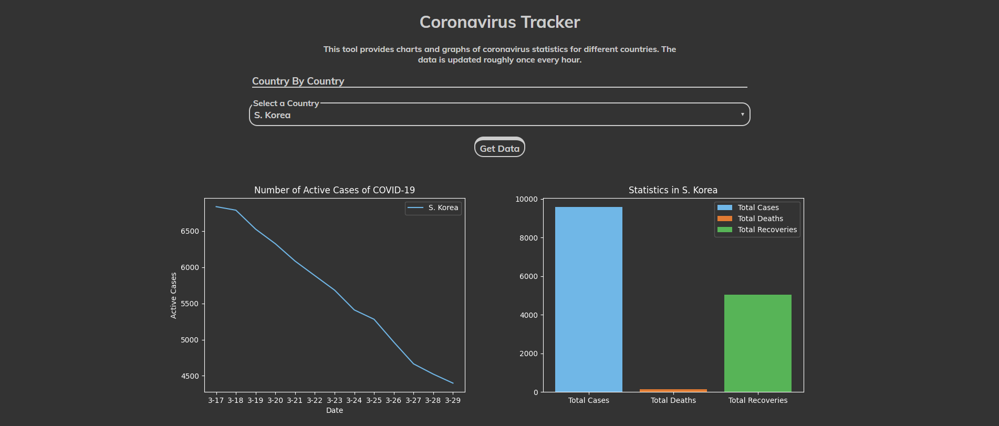
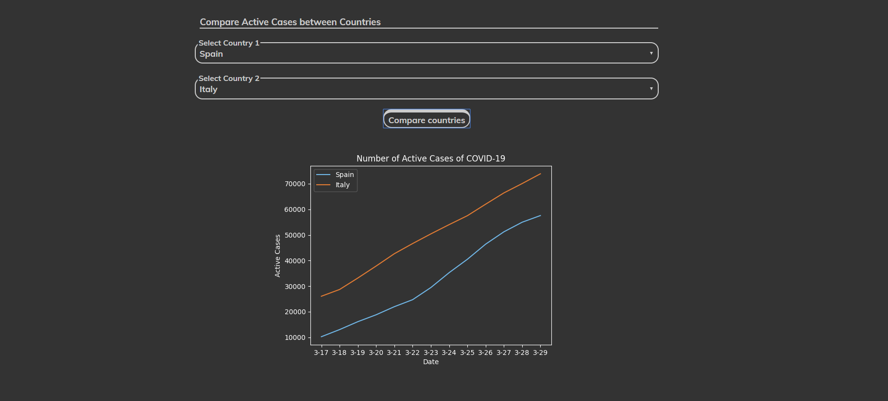

CoronaVirus Tracker was a collab between Sam Williams (ayunami2000 on GitHub), Ali Ahmad (aahmad4 on Github) & Myself. 

The website(designed with HTML,CSS,NodeJS & a Python Backend) tracks international data on the COVID-19 pandemic and displays it in easy to read graphics. I was responsible for the the data collection, preproccessing, and visualization processes. To see the website, click this link:
https://coronatracker.glitch.me/

